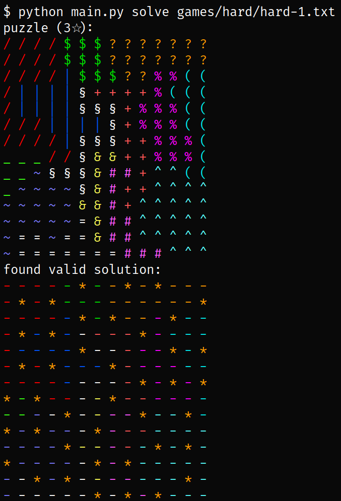

# HPI_Quantastic: Star Battle / Two Not Touch

## About the game
This repository implements the popular game created by [Krazydad](https://krazydad.com/twonottouch/) and solves it using D-Wave's Quantum Annealing. We use the [Ocean SDK](https://docs.ocean.dwavesys.com/en/stable/) provided by D-Wave.

To get a feel for the game, you can try it out online [https://www.puzzle-star-battle.com/](here).

## Goals
The project should educate players on the power of quantum computing. While human players try one combination after the other, the quantum computer tries all combinations at the same time. This approach is also vastly different from classical computers which take a long time to solve this kind of puzzle.

## Modelling the game
The board is always quadratic and is divided into _blocks_. We represent each block with a unique number. Therefore, we represent a Star Battle / Two Not Touch puzzle as a square matrix that contains the block number of each cell as well as a number specifying how many stars each row / column / block should contain. We have taken a few sample puzzles of varying difficulty from Krazydad's online books that can be used with the program.

To model the game, we use a [QUBO](https://en.wikipedia.org/wiki/Quadratic_unconstrained_binary_optimization) with one binary variable for each position on the board. Additionally, each game contains information on how many stars should be in each row, column and block. We call this constant `num_stars`.

There are a few constraints that a given solution has to follow:

- There must be exactly `num_stars` stars in every row
- There must be exactly `num_stars` stars in every column
- There must be exactly `num_stars` stars in every block
- No two stars are allowed to be adjacent (diagonal adjacency counts as well)

We use [`dimod.generators.constraints.combinations`](https://docs.ocean.dwavesys.com/projects/dimod/en/latest/reference/bqm/generated/dimod.generators.constraints.combinations.html) for the first three constraints. We manually add the interactions between adjacent cells.

As our sampler, we use [`LeapHybridSampler`](https://docs.ocean.dwavesys.com/projects/system/en/stable/reference/samplers.html#leaphybridsampler).

## Installation

For installation, run `pip install -r requirements.txt`. The `LeapHybridSampler` requires a Leap API token to be configured. For more information, consult the [Ocean installation guide](https://docs.ocean.dwavesys.com/en/stable/overview/install.html).

## Usage

There are two modes of interaction: the program can either `solve` the specified puzzle or you can `play` interactively against the quantum computer.

### Solve

Usage: `python main.py solve <file>`

This prints a textual representation of the problem and the solution as well as whether the solution is valid:

### Play
Usage: `python main.py play <file>`

This uses `pygame` to let a user play Star Battle / Two Not Touch interactively. It also times the user against `LeapHybridSampler`.

If you're only interested in the solution of the field, you can select _Show Solution_, after the `LeapHybridSampler` returned a solution. In the lower left corner you also get information why your solution is invalid:

If you were able to solve the puzzle, and the `LeapHybridSampler` returned a valid result, the GUI shows the time it took you to solve the puzzle and the time for the `LeapHybridSampler`:

## Contributors

Part of Team HPI_Quantastic were:

- [Jacob Schäfer](https://github.com/jacob271)
- [Alexander Sohn](https://github.com/Sohn123)
- [Richard Wohlbold](https://github.com/rgwohlbold)
